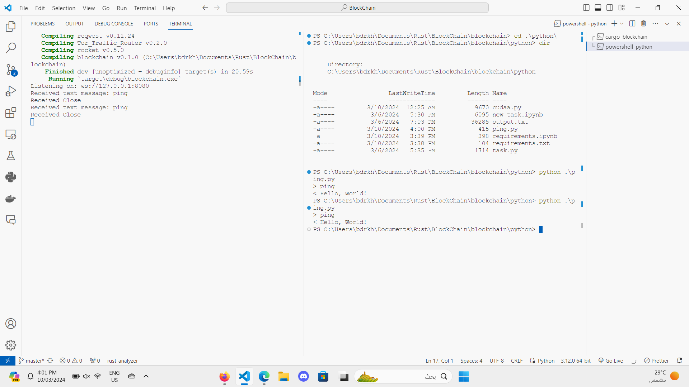

# 🚀 Alpha Centauri Blockchain: Next-Gen Privacy is Here! 🚀

## Table of Contents

- [🚀 Alpha Centauri Blockchain: Next-Gen Privacy is Here! 🚀](#-alpha-centauri-blockchain-next-gen-privacy-is-here-)
  - [Table of Contents](#table-of-contents)
  - [Getting Your Feet Wet 🌊](#getting-your-feet-wet-)
    - [Setup Real Quick](#setup-real-quick)
      - [Let's Roll 🎲](#lets-roll-)
  - [What's this? 📱](#whats-this-)
    - [Proof of Computing](#proof-of-computing)
    - [Keep it on the DL](#keep-it-on-the-dl)
    - [Cash Rules](#cash-rules)
  - [Sneak Peek Code 🕵️‍♀️](#sneak-peek-code-️️)
    - [Dive Deeper 🤿](#dive-deeper-)
  - [💥 Reward System🚀](#-reward-system)
  - [Yo, What's Up With The 1 Block Reward? 🤔💸](#yo-whats-up-with-the-1-block-reward-)
  - [Time Travel But For Crypto 🚀🕒](#time-travel-but-for-crypto-)
  - [Treasure Hunt: Total Circulation 🏴‍☠️💰](#treasure-hunt-total-circulation-️)
  - [Wrap It Up, Will Ya? 🎁](#wrap-it-up-will-ya-)
  - [Holla at Us 📢](#holla-at-us-)
  - [🚀 How The Trustless System works! 🌈](#-how-the-trustless-system-works-)
    - [Yo, Future Blockchain Moguls! 👾](#yo-future-blockchain-moguls-)
    - [📋 The Ultimate To-Do List](#-the-ultimate-to-do-list)
      - [1. **Give Back to Get Ahead** 🎗️](#1-give-back-to-get-ahead-️)
      - [2. **Set Up Your Secret Lair** 🧅](#2-set-up-your-secret-lair-)
      - [3. **Link Up and Lock Down** 🔗🔒](#3-link-up-and-lock-down-)
      - [4. **Receive the Digits** 💰](#4-receive-the-digits-)
      - [5. **Make It Rain (New Funds, Who Dis?)** 💳](#5-make-it-rain-new-funds-who-dis-)
      - [6. **Seal the Deal** ✅](#6-seal-the-deal-)
    - [🌟 Conclusion](#-conclusion)
  - [🚀 Proof of Computing: Get Rewarded for Flexing Your AI Muscles! 💪🤖](#-proof-of-computing-get-rewarded-for-flexing-your-ai-muscles-)
    - [🧠 Train \& Gain](#-train--gain)
    - [🎓 Learning = Earning](#-learning--earning)
    - [🎉 How It Works](#-how-it-works)
    - [🌈 The Real MVPs](#-the-real-mvps)
  - [How to Calculate TeraFLOPs Like a Gen Z Pro 🚀✨](#how-to-calculate-teraflops-like-a-gen-z-pro-)
  - [What's a TeraFLOP, You Ask? 🤔💥](#whats-a-teraflop-you-ask-)
  - [Getting the Deets (Details, obvi) 📊👀](#getting-the-deets-details-obvi-)
    - [Step 1: Warm-Up 🏃‍♂️🔥](#step-1-warm-up-️)
    - [Step 2: The Magic Spell 🧙‍♂️✨](#step-2-the-magic-spell-️)
    - [Step 3: Flex 💪🌟](#step-3-flex-)
      - [Example Output](#example-output)
  - [Pro Tips for True Techies 🎓🚀](#pro-tips-for-true-techies-)
  - [Conclusion: You're Now a TeraFLOP Titan 🏆✨](#conclusion-youre-now-a-teraflop-titan-)
    - [🚀 Train Your Models Like a Boss! 📈🔥](#-train-your-models-like-a-boss-)
  - [💎 Unleash The Power of Your Data](#-unleash-the-power-of-your-data)
  - [🤖 What's the Deal?](#-whats-the-deal)
  - [💻 Features That Will Make You Go "Woah!"](#-features-that-will-make-you-go-woah)
  - [🚀 How to Get Started](#-how-to-get-started)
  - [Directories](#directories)
  - [🛠 Installation Guide (The Gen Z Way)](#-installation-guide-the-gen-z-way)
    - [1. Getting OpenSSL (The Gatekeeper)](#1-getting-openssl-the-gatekeeper)
    - [2. Let's Get Rusty](#2-lets-get-rusty)
    - [3. Build and Run](#3-build-and-run)
    - [4. install the required packages](#4-install-the-required-packages)
    - [5. OpenSSL Dance](#5-openssl-dance)
  - [🎉 Boom! You're Now a Rustacean-Crypto-Wizard!🧙🏼‍♂️🔮🎩🪄✨](#-boom-youre-now-a-rustacean-crypto-wizard️)
  - [Big Update #1](#big-update-1)
  - [Update **2**](#update-2)
    - ["WebSquad connects nodes using WebSocket. Ping yourself, check Tor status, and sync with peers listed in 'dns.txt'. Dive into decentralized networking! #WebSquad"](#websquad-connects-nodes-using-websocket-ping-yourself-check-tor-status-and-sync-with-peers-listed-in-dnstxt-dive-into-decentralized-networking-websquad)
      - ["Connect and vibe with your digital tribe! 🌐 Our 'WebSquad' platform pings via WS, linking you to other cool WS clients. Stay synced, stay connected. #WebSquad #StayLinked"](#connect-and-vibe-with-your-digital-tribe--our-websquad-platform-pings-via-ws-linking-you-to-other-cool-ws-clients-stay-synced-stay-connected-websquad-staylinked)
    - [💌 Holla at Us](#-holla-at-us)

Yo, what’s up, fam? Welcome to the dopest blockchain on the block - **Alpha Centauri**. 🌌 Forget all that old-school balance and address nonsense. We’re here to flip the script with our unique **banknotes vibe** - think exclusive signed rewards you can flex with your private key. 🗝️💰

## Getting Your Feet Wet 🌊

No Rust? No problem! Slide over to [Rust's crib](https://www.rust-lang.org/learn/get-started) to get set up. This isn't just a blockchain; it's your ticket to helping the AI fam while staying ghost online. 🕵️‍♂️

### Setup Real Quick

Grab the goods with:

```bash
git clone https://github.com/BDR-Pro/blockchain.git
cd blockchain
```

Make sure your `Cargo.toml` is popping with:

```toml
chrono = "0.4"
serde = { version = "1.0", features = ["derive"] }
sha2 = "0.10"
openssl = "0.10"
serde_json = "1.0"
```

#### Let's Roll 🎲

Jump into your project space and kick it off with:

```bash
cargo run
```

## What's this? 📱

### Proof of Computing

Do good, feel good. Share your computing power and help the science squad level up. 🧠🔬

### Keep it on the DL

Connect with the crew through Tor. It's all about that stealth mode. Check the [Tor Traffic Router](https://crates.io/crates/Tor_Traffic_Router) to get the lowdown.

### Cash Rules

- **Big Baller**: Alpha Centauri
- **Pocket Change**: Tensor (1 millionth of a boss Alpha Centauri)

## Sneak Peek Code 🕵️‍♀️

Check this:

```rust
// Essential imports and the blueprint...

fn sign(message: &String) -> Vec<u8> {
    // Secret handshake logic...
}

#[derive(Debug, Serialize, Deserialize)]
struct Block {
    // The building blocks...
}

impl Block {
    fn new(data: String, previous_hash: String, block_number:u64 , reward:u64) -> Result<Block, &'static str> {
        // Crafting the block...
    }
}

// Dive deeper into the matrix...
```

### Dive Deeper 🤿

Get nosy. Break it down. Remix it. This is your playground.

## 💥 Reward System🚀

## Yo, What's Up With The 1 Block Reward? 🤔💸

Alright, alright, alright, let's break it down real simple. You know how in the crypto world things keep halving until they're like, super tiny? We crunched some hardcore numbers and guess what? 🧐

After vibing through exactly **655,360 blocks**, our rewards are hitting that sweet, sweet spot of just **1 per block**. Yeah, you heard that right! But like, don't rush; this ain't happening overnight. We're talking a chill journey of about **12.47 years**. Set your calendars, folks! 📅⏳

## Time Travel But For Crypto 🚀🕒

We're not just dropping numbers for the fun of it. Imagine this: every block's a 10-minute mini-party, and after 655,360 of those, bam, we land at the 1 reward station. But here's the kicker – it's gonna take us around **12.47 years**. Yeah, that's a lot of TikToks you could scroll through. 📱👀

## Treasure Hunt: Total Circulation 🏴‍☠️💰

Now, let's talk the big bucks, the total moolah in circulation by the time we hit the 1 per block paradise. We're looking at a whopping **102,710,272** in the vault! That's right, start dreaming of all the avocados and lattes that could buy. 🥑☕

## Wrap It Up, Will Ya? 🎁

So there you have it, folks! Kick back, relax, and let the blocks roll because we're in for a long ride to 1-ville. Remember, in the crypto game, patience is more than just a virtue; it's the way to the treasure. 🏆🔑

Stay tuned, stay hyped, and keep those blocks stacking! 🎉🔥

## Holla at Us 📢

Got fire ideas? We’re all ears. Hit us up with an issue or slide into our DMs with a pull request. Let’s skyrocket Alpha Centauri to the moon! 🌕🚀

## 🚀 How The Trustless System works! 🌈

### Yo, Future Blockchain Moguls! 👾

Wanna dive into the wild world of crypto donations, onion servers, and making bank (securely)? Buckle up, 'cause we're spilling the tea on how to get your digital wallets thicc while supporting science. Let's get this bread, but like, responsibly. 🍞💸

### 📋 The Ultimate To-Do List

#### 1. **Give Back to Get Ahead** 🎗️

- Wanna train your model? Cool, but let's not forget the little guys. Pledge **10% of today's reward** to the science research labs on the blockchain. It's like tipping your barista, but for brainiacs.
- The donation percentage, such as **10%**, varies based on the **teraFLOPs** required for successful mining operations.
- Check out the list of eligible labs and make your donation. Remember, karma's a boomerang – what goes around, comes around!

#### 2. **Set Up Your Secret Lair** 🧅

- Time to go underground. Set up your `.onion` server. Yeah, it's not just for secret recipes; it's your portal to the crypto underworld.
- Not sure how? Look up "Setting up an onion server" and follow the steps. It's like following a recipe, but instead of a cake, you get a secure server.

#### 3. **Link Up and Lock Down** 🔗🔒

- Got your `.onion` link? Sweet. Share it with your peeps who wanna send you funds. But remember, with great power comes great responsibility.
- Keep it on the down-low. Only share with trusted contacts. We're building a trust tree here, folks.

#### 4. **Receive the Digits** 💰

- Once your buddy sends over their banknote serial number (aka their funds' private key), you're ready to roll.
- This number is like the secret handshake. Treat it with respect.

#### 5. **Make It Rain (New Funds, Who Dis?)** 💳

- Time to generate a new pair of ECDSA (Elliptic Curve Digital Signature Algorithm) keys. It's like getting a brand-new identity, but for your wallet.
- Sign a new message declaring the fund transfer from the old banknote to your shiny new one. It's like renewing your vows, but with money.

#### 6. **Seal the Deal** ✅

- Finalize the transaction. Confirm the amount transferred matches the old banknote. No bamboozles allowed.
- Once verified, consider your purchase donezo. Congratulations, you've officially entered the crypto cool kids club.

### 🌟 Conclusion

Welcome to the future, where your transactions are as secure as your DMs should be. Remember, this isn't just about making money; it's about building a community, supporting science, and staying secure. So, let's get to work, but also let's keep it fun. Stay safe, stay savvy, and let's disrupt the digital world one transaction at a time. 🎉💥

## 🚀 Proof of Computing: Get Rewarded for Flexing Your AI Muscles! 💪🤖

Yo, fam! Welcome to the future where your brainpower boosts your bank balance. Welcome to the lit side of tech – **Proof of Computing**. It’s not just about mining; it’s about shining. 💎✨

### 🧠 Train & Gain

Forget hitting the gym; let's get those neural networks pumping! Here’s the deal:

- **Train a Model, Stack that Coin**: Dive into our platform, pick a model, and start training. Your computer does the heavy lifting, and you? You just chill and watch the rewards roll in. 🏋️‍♂️💰

- **Eco-Friendly Flex**: Sick of blockchain baddies wrecking the planet? Us too. Proof of Computing is all about that green energy, baby. Train models, save the world, get paid. Captain Planet would be proud. 🌍❤️

### 🎓 Learning = Earning

- **All the Cool Kids Are Doing It**: Jump on board with AI enthusiasts, data scientists, and the curious cats of Gen Z. Whether you’re a seasoned pro or just AI-curious, there’s room for everyone.

- **Expand Your Mind and Wallet**: Every model you train helps solve real-world problems, from cracking climate change to revolutionizing medicine. And yeah, you get rewarded for it. Knowledge is power, and now, it’s also profit. 📚➡️💸

### 🎉 How It Works

1. **Donwload the .exe**: Grab your digital gear and download our Proof of Computing .exe. It’s like getting a backstage pass to the AI world.

2. **Select Your Mission**: Choose which AI model you wanna help train. From detecting cute cats online to predicting the next big TikTok trend, we’ve got it all.

3. **Let the Games Begin**: Set your computer to work. Go binge-watch your fave series, and let your PC do its thing.

4. **Rewards Galore**: Done training? BOOM! Rewards land straight into your account. It’s like finding money in your other jeans, but way cooler.

### 🌈 The Real MVPs

At the end of the day, it’s not just about making bank. It’s about making a difference. By contributing your computing power, you're part of something bigger – a community of do-gooders, dreamers, and data crunchers making the digital world a better place.

So, what are you waiting for? Join us, get smart, get paid, and let’s make the internet awesome together. 🚀👾

## How to Calculate TeraFLOPs Like a Gen Z Pro 🚀✨

Hey fam! Welcome to the ultra-cool, super chill guide on calculating those big brain numbers we call TeraFLOPs. If you're diving into the deep end of AI models or just wanna flex on your tech squad, you've come to the right place. Let's decode this like we're breaking into the mainframe of the future. 🌐💻

## What's a TeraFLOP, You Ask? 🤔💥

A TeraFLOP (that's 'floating-point operations per second', if you wanna get all dictionary about it) is like the horsepower of your AI ride. It tells you how many trillions of math problems your computer or model can solve every second. More TeraFLOPs? More power to you – literally. We're talking mega mind speeds, people!

## Getting the Deets (Details, obvi) 📊👀

Before you start, you'll need:

- Your model (this ain't no fashion show – we're talking neural networks, baby!)
- Some tools (TensorFlow, PyTorch, or whatever floats your computational boat)
- A vibe for adventure (mandatory, no exceptions)

### Step 1: Warm-Up 🏃‍♂️🔥

Get your model up and running. Make sure it's trained, loaded, and ready to show off its smarts. We're about to put it to the test!

### Step 2: The Magic Spell 🧙‍♂️✨

If you're using a tool like TensorFlow or something similar, there's usually a way to calculate those FLOPs. It might involve some code – don't panic! Copy-paste is your friend, and so is Google.

If you’re all about that Python life (and who isn’t?), here’s a little something you might use:

```python
# Python wizardry here
import tensorflow as tf
from tensorflow.python.profiler.model_analyzer import profile
from tensorflow.python.profiler.option_builder import ProfileOptionBuilder

def estimate_model_teraflops(model):
  forward_pass = tf.function(model.call, input_signature=[tf.TensorSpec(shape=(1,) + model.input_shape[1:])])
  graph_info = profile(forward_pass.get_concrete_function().graph, options=ProfileOptionBuilder.float_operation())
  flops = graph_info.total_float_ops
  return flops  / 10**12

print(f"Your model is flexing with {estimate_model_teraflops(model)} TeraFLOPs!")
```

### Step 3: Flex 💪🌟

Got that number? That's how powerful your AI model is. Share it with friends, make your enemies jealous, and maybe even impress your cat with your big brain energy.

#### Example Output

```bash
Epoch 1/5
1875/1875 ━━━━━━━━━━━━━━━━━━━━ 5s 2ms/step - accuracy: 0.8798 - loss: 0.4296
Epoch 2/5
1875/1875 ━━━━━━━━━━━━━━━━━━━━ 3s 1ms/step - accuracy: 0.9657 - loss: 0.1165
Epoch 3/5
1875/1875 ━━━━━━━━━━━━━━━━━━━━ 3s 1ms/step - accuracy: 0.9788 - loss: 0.0744
Epoch 4/5
1875/1875 ━━━━━━━━━━━━━━━━━━━━ 4s 2ms/step - accuracy: 0.9839 - loss: 0.0540
Epoch 5/5
1875/1875 ━━━━━━━━━━━━━━━━━━━━ 3s 1ms/step - accuracy: 0.9875 - loss: 0.0426
313/313 ━━━━━━━━━━━━━━━━━━━━ 0s 940us/step - accuracy: 0.9743 - loss: 0.0904
Loss: 0.07741480320692062, Accuracy: 0.9783999919891357
teraFLOP: 2.03452e-07
```

## Pro Tips for True Techies 🎓🚀

- **Accuracy Over Speed**: Remember, more TeraFLOPs doesn't always mean smarter, just like more horsepower doesn't make you a better driver.
- **Stay Updated**: Tech moves fast. Keep your tools and knowledge fresh to stay on top of the game.
- **Community Is Key**: Stuck? Ask around. The internet is full of nerds (we say that lovingly) who live for this stuff.

## Conclusion: You're Now a TeraFLOP Titan 🏆✨

And that's a wrap! You've just leveled up in the tech game. Use your powers for good, keep learning, and always remember: in the world of AI, today's flex is tomorrow's old news. Stay curious, stay cool, and keep calculating those TeraFLOPs! 🌟💜

Peace out, digital pioneers! Keep rocking the data wave! 🌊👩‍💻👨‍💻

### 🚀 Train Your Models Like a Boss! 📈🔥

## 💎 Unleash The Power of Your Data

Welcome to **CryptoModelTrainer**! If you're all about that crypto life and wanna train your models like a boss – you've just found your new best friend. 🚀

## 🤖 What's the Deal?

We're revolutionizing how you train your machine learning models for the crypto market. Think less hassle, more dazzle. you provide the brains (a.k.a. your Jupyter notebook), and we do the heavy lifting. It's like having your own data science squad, but cooler. 💡

## 💻 Features That Will Make You Go "Woah!"

- **Jupyter Notebook Magic**: We're all about that Python life. Just drop your notebook, and we'll handle the rest. 🐍
- **Data Science Vibes**: Whether you're into predicting crypto trends or analyzing market data, we've got your back. 📈
- **Slick Model Training**: Just feed us your notebook, and watch magic happen. 🧙‍♂️
- **Speedy Results**: Get outputs faster than you can say "Blockchain". 🏎️💨
- **Crystal Clear Outputs**: We keep it 100. Your results, your gains. 📊
- **Secure & Private**: Your data is your business. We keep it locked down. 🔒

## 🚀 How to Get Started

-Ready to dive in? Here's how to get started:

- **Step 1**: Read new_task.ipynb and understand the task.
- **Step 2**: Write your code in the new_task.ipynb file.
- **Step 3**: Run the mine.rs file.
- **Step 4**: Check the output in the output.txt file.
- **Step 5**: Celebrate your model training success! 🎉
- **Step 6**: Share your results with the world. You're a data hero now. 🦸‍♂️
- **Step 7**: Keep training, keep learning, and keep making the crypto world a better place. 🌍

## Directories

```bash
 /blockchain
│
├── my_keys
│   └── {timestamp}_{blocknumber}_{reward}.pem
│
├── my_blocks
│   └── {blocknumber}.json
│
├── my_flops
│   └── teraflops.txt
│
└── my_backup
    ├── output.txt -> UUID.txt
    └── task.py -> UUID.py
```

## 🛠 Installation Guide (The Gen Z Way)

We hate boring setups, so we made this as easy as ABC. But hey, before you jump in, make sure you've got OpenSSL coz we're all about that security life. 🔒

### 1. Getting OpenSSL (The Gatekeeper)

- **Windows Peeps**: Grab the installer from [this link](https://slproweb.com/products/Win32OpenSSL.html). Choose the version marked 'Light' cause we like to keep it breezy. Install it and **remember the path where you put it**; you're gonna need it.
  
- **Mac Users**: Chill, just open your terminal and hit `brew install openssl`. Homebrew's got your back.

- **Linux Gang**: You probably already have OpenSSL, but if not, `sudo apt-get install libssl-dev` (for Ubuntu) or the equivalent for your distro will sort you out.

### 2. Let's Get Rusty

Make sure you've got Rust installed. No? No worries:

```bash
curl --proto '=https' --tlsv1.2 -sSf https://sh.rustup.rs | sh
```

Restart your terminal, and boom, you're in the Rust club.

### 3. Build and Run

Now, the moment of truth. Let's compile this masterpiece:

```bash
cargo build
```

And then, set the stage on fire with:

```bash
cargo run
```

### 4. install the required packages

```bash
pip install tensorflow
```

### 5. OpenSSL Dance

If Rust starts asking where OpenSSL is at (like, "Hey, I need those secure vibes"), you tell it straight:

- **Windows**: Set `OPENSSL_DIR` environment variable to your OpenSSL path.
- **Unix-like (Mac/Linux)**: Usually chill, but if it gets fussy, export that `PKG_CONFIG_PATH` pointing to your OpenSSL lib directory.

## 🎉 Boom! You're Now a Rustacean-Crypto-Wizard!🧙🏼‍♂️🔮🎩🪄✨

Congrats! You've just set up **Alpha centuri**. Dive into the code, make some noise, and build something that'll make the blockchain jealous.

## Big Update #1

>**1** add blockchain_maker as external crate

```toml
[dependencies]
blockchain_maker = 1.1.0
```

>**2** add webSocket to the project

```toml
[dependencies]
websocket = "0.22.0"
```

>**3** add cudaa.py to the project
as another way to calculate teraflops

```python

# Define the CUDA kernel for matrix multiplication
@cuda.jit
def matmul(A, B, C):
    row, col = cuda.grid(2)  # Get the 2D thread indices
    if row < C.shape[0] and col < C.shape[1]:
        tmp = 0.0
        for k in range(A.shape[1]):
            tmp += A[row, k] * B[k, col]
        C[row, col] = tmp

```

>**4** add requirements.ipynb to the project just run it to install the required packages

```bash

python3 -m pip install -r requirements.txt

```

>**5** add ping.py to the project to check the connection between the server and the client

```python


async def test_ws():
    uri = "ws://localhost:8080"
    async with websockets.connect(uri) as websocket:
        # Sending a "ping" message
        await websocket.send("ping")
        print("> ping")

        # Waiting for a response
        response = await websocket.recv()
        print(f"< {response}")


```



## Update **2**


### "WebSquad connects nodes using WebSocket. Ping yourself, check Tor status, and sync with peers listed in 'dns.txt'. Dive into decentralized networking! #WebSquad"

#### "Connect and vibe with your digital tribe! 🌐 Our 'WebSquad' platform pings via WS, linking you to other cool WS clients. Stay synced, stay connected. #WebSquad #StayLinked"


1. **Start Server**: Initialize WebSocket server on port 8888.
2. **Receive Message**: Await "ping" message from connected clients.
3. **Read File**:
   - Open `dns.txt`.
   - Retrieve the last line (representing the latest DNS entry).
4. **Respond to Client**:
   - If received message is "ping", send back the last entry.
   - On error (e.g., file read error), send an error message.
5. **Loop**: Continue listening for new messages and clients.

---

### 💌 Holla at Us

Got questions, suggestions, or just wanna chat about the meaning of life? Slide into our DMs. Let’s make magic happen together.

Let’s get this computational party started! 🎉💻
